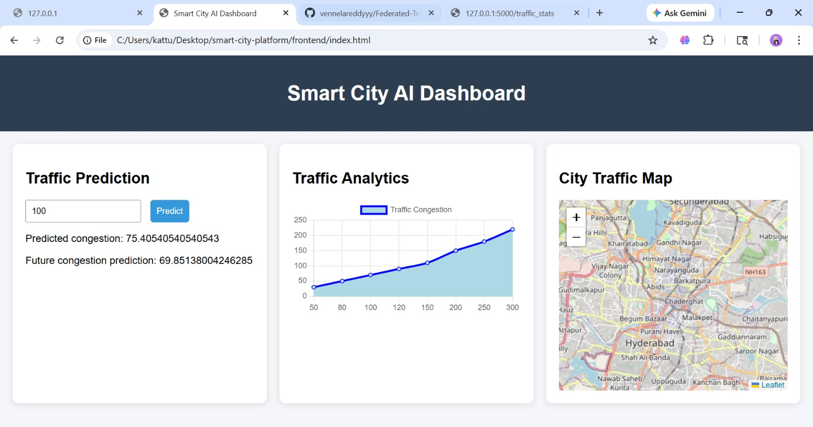

S# Smart City AI Platform

An AI-powered decision support platform for **traffic congestion prediction and smart city monitoring**.

This system provides an interactive dashboard that predicts traffic congestion using machine learning, visualizes traffic analytics, and displays monitoring locations on an interactive city map.

---

## Dashboard Preview

---

## Features

- AI-based Traffic Congestion Prediction
- Interactive Smart City Dashboard
- Traffic Analytics Visualization using charts
- City Traffic Monitoring Map using Leaflet
- Machine Learning model for congestion forecasting

---

## Tech Stack

### Frontend
- HTML
- CSS
- JavaScript
- Chart.js
- Leaflet.js

### Backend
- Python
- Flask

### Machine Learning
- Scikit-Learn
- Linear Regression

---

## Project Architecture

Frontend Dashboard  
↓  
Flask Backend API  
↓  
Machine Learning Model  
↓  
Traffic Dataset

---

## Author

**Vennela Reddy**  
MS Computer Science – Data Science  
University of North Carolina at Charlotte
